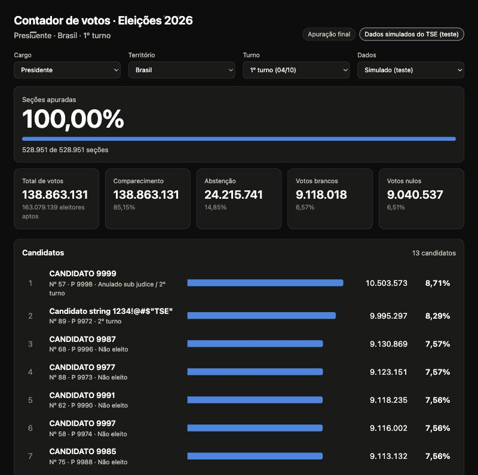
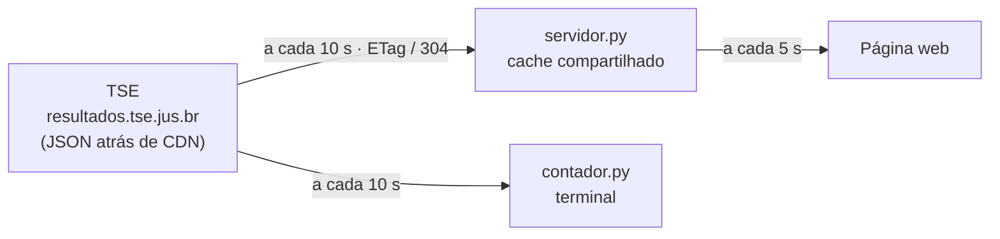

# 🗳️ Contador de votos · Eleições 2026

**Acompanhe a totalização do TSE quase em tempo real, no navegador ou no terminal.**




> A imagem usa os **dados simulados** que o TSE disponibiliza para teste. Os nomes são fictícios.

O programa **não conta votos**: ele lê os arquivos JSON de resultado que o TSE publica e mostra o placar. Só a divulgação oficial do TSE tem valor legal.

## Destaques

- Presidente, governador, senador e deputados federal, estadual e distrital, por UF, no 1º e no 2º turno.
- Página web com tema claro e escuro, boa no celular, que atualiza sozinha. O endereço guarda a seleção, então dá para compartilhar `?cargo=governador&uf=sp`.
- Placar no terminal para quem prefere.
- Um servidor consulta o TSE e reparte a resposta com todos os visitantes. Mais gente na página não aumenta o acesso ao TSE.
- Respeita as regras de acesso do TSE (veja [abaixo](#regras-de-acesso-do-tse)).
- Só biblioteca padrão do Python. Nada para instalar.

## Como rodar

### Com Docker

```bash
cp .env.example .env     # opcional: muda a porta (padrão 8000)
make up                  # ou: docker compose up -d --build
```

Abra <http://127.0.0.1:8000>. Para parar: `make down`. Para ver os logs: `make logs`.

A porta é publicada só em `127.0.0.1`. Para abrir na rede local, troque o mapeamento em [compose.yaml](compose.yaml).

### Sem Docker

```bash
make web                 # ou: python3 servidor.py --porta 8000
```

### No terminal

```bash
python3 contador.py                              # presidente, Brasil
python3 contador.py -c governador --uf sp        # governador de São Paulo
python3 contador.py -c senador --uf mg --top 5   # senador de Minas, 5 primeiros
python3 contador.py --turno 2                    # segundo turno (25/10)
python3 contador.py --ambiente simulado          # dados de teste do TSE
```

| Opção | O que faz | Padrão |
|---|---|---|
| `-c`, `--cargo` | `presidente`, `governador`, `senador`, `deputado-federal`, `deputado-estadual`, `deputado-distrital` | `presidente` |
| `--uf` | sigla da UF; `br` só vale para presidente | `br` (presidente) |
| `--turno` | `1` ou `2` (só presidente e governador têm 2º turno) | `1` |
| `--ambiente` | `oficial` ou `simulado` (dados de teste do TSE) | `oficial` |
| `--top` | quantos candidatos mostrar | `15` |
| `--intervalo` | segundos entre consultas (mínimo 10) | `10` |
| `--uma-vez` | consulta uma vez e sai | desligado |

Antes da apuração começar, o arquivo oficial já existe com os candidatos e todos os votos zerados.

## Como funciona



### Atraso: é quase tempo real

Não existe voto a voto ao vivo. O TSE publica novos totais a cada totalização das urnas, e os arquivos passam por CDN.

Medindo o arquivo oficial, o CDN renova a cópia a cada cerca de 12 segundos, mas manda `max-age` de 17 a 54 segundos. Seguir esse `max-age` atrasaria o placar sem necessidade. Por isso o contador consulta o TSE a cada 10 segundos com `If-None-Match`: o TSE responde 304 quando nada mudou, são cerca de 6 consultas por minuto por seleção, bem abaixo do limite de 100 por segundo.

O atraso que o contador soma é de até uns 15 segundos. O resto depende de quando o TSE publica. A página e o terminal mostram o horário da última totalização do TSE para você conferir.

## API

`GET /api/resultado` devolve JSON.

| Parâmetro | Valores | Padrão |
|---|---|---|
| `cargo` | os mesmos da linha de comando | `presidente` |
| `uf` | sigla da UF, ou `br` para presidente | `br` (presidente) |
| `turno` | `1` ou `2` | `1` |
| `ambiente` | `oficial` ou `simulado` | `oficial` |
| `top` | de 1 a 100 candidatos | `15` |

```json
{
  "final": false,
  "ultima_totalizacao": "04/10/2026 18:01:02",
  "secoes": { "total": 499248, "apuradas": 120000, "percentual": 24.04 },
  "eleitores": { "aptos": 158745502, "comparecimento": 30000000, "pct_comparecimento": 81.2 },
  "votos": { "total": 30000000, "brancos": 900000, "pct_brancos": 3.0, "nulos": 1500000, "pct_nulos": 5.0 },
  "total_candidatos": 12,
  "candidatos": [
    { "posicao": 1, "numero": "13", "nome": "NOME", "partido": "PT", "votos": 12000000, "percentual": 41.2, "eleito": false, "situacao": "" }
  ],
  "ambiente": "oficial",
  "idade_s": 4
}
```

Os números acima são só de exemplo e o JSON foi resumido (a resposta real traz também abstenção, horário de geração do arquivo e outros campos). Códigos de resposta: `200` com dados, `400` seleção inválida, `404` o TSE ainda não publicou, `503` o TSE não respondeu. Se o TSE falhar mas houver um placar antigo, ele é devolvido com o campo `aviso`. `GET /saude` responde `ok` (usado pelo healthcheck do Docker).

## Regras de acesso do TSE

O TSE limita o acesso a 100 requisições por segundo por IP e bloqueia o IP por 10 minutos se o limite for passado ou se houver muitos erros 404 seguidos. Por isso:

- a consulta é no mínimo a cada 10 segundos e usa `If-None-Match` (ETag);
- o terminal encerra no primeiro 404, em vez de repetir (cargo, UF ou turno errado);
- o servidor web guarda o 404 por 60 segundos e, se passar de 10 em um minuto, para de tentar URLs novas por um tempo;
- o servidor só monta URLs a partir de valores conhecidos (cargo, UF, turno e ambiente validados), então nada que o visitante digita vai parar na URL do TSE;
- ao receber 403 ou 429, espera 10 minutos e continua mostrando o último placar.

## Estrutura

```
contador.py        leitura do TSE e placar no terminal
servidor.py        servidor web: cache compartilhado e API
index.html         página (HTML, CSS e JS num arquivo só)
test_*.py          testes (unittest)
Dockerfile         imagem da página web
compose.yaml       sobe a página web com Docker
Makefile           atalhos: make up, make web, make teste
docs/painel.jpg    imagem usada neste README
```

## Desenvolvimento

```bash
make teste               # ou: python3 -m unittest -v
```

Os testes não acessam a internet. A CI (`.github/workflows/ci.yml`) roda os testes no Python 3.9 e 3.12 e constrói a imagem Docker.

Limites conhecidos:

- Não verifica a assinatura JWS dos arquivos do TSE (veja o manual na página abaixo).
- Os arquivos do 2º turno só existem depois que o TSE os publica; antes disso a página avisa que ainda não há resultado.

## Fontes

- Especificação dos arquivos e códigos das eleições: <https://www.tse.jus.br/eleicoes/informacoes-tecnicas-sobre-a-divulgacao-de-resultados>
- Resultados no navegador: <https://resultados.tse.jus.br>
